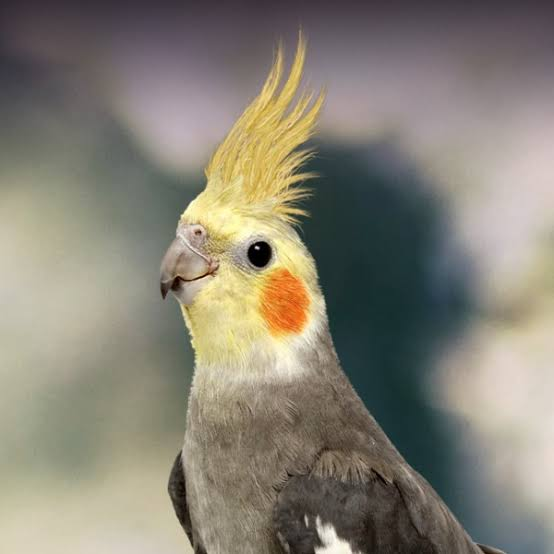
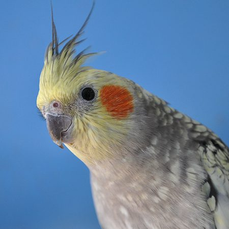

# images

 
 

# lists
<ol>
  <b>First List<b>
  <li>First item</li>
  <li>Second item</li>
  <li>Third item</li>
  <li>Fourth item</li>
</ol>
<ol>
  <b>Second List<b>
  <li>A</li>
  <li>B</li>
  <li>C</li>
  <li>D</li>
</ol>

# links
My Other projects 
[Robotic hand in simulink](https://github.com/JiayouQin/Simulink-Robotic-Hand-Gesture) 
[Stick man](https://github.com/JiayouQin/Python-projects/tree/master/27%20Stickman%20with%20inverse%20kinematics)
